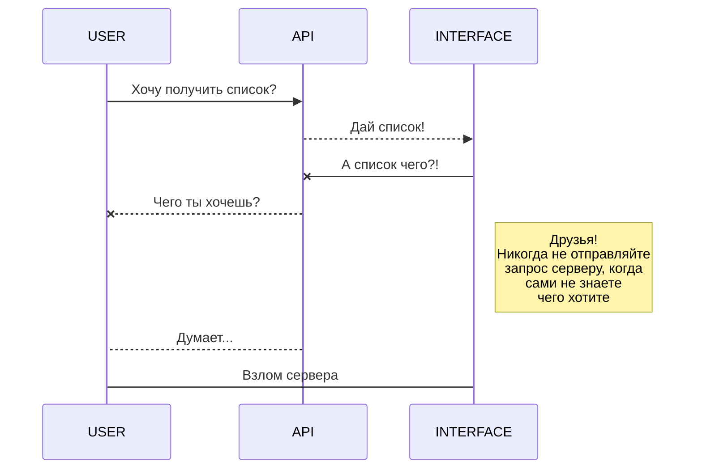
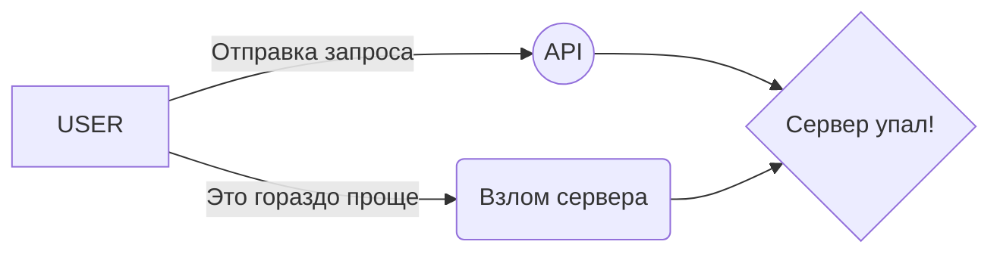

# Добро пожаловать на yatube_api!

Привет! Я хочу чтобы тесты из **Yandex Practicum**. засчитали мне то, что я оформил красиво данный файл. Сам пока я еще не начал делать это задание и возможно в будущем подправлю данный текст, но пока что менять ничего не хочу.

# Проект

Тут какая то информация должна быть о том, как работает это **API**, но я уже говорил - потом сделаю. Често!

# Таблицы

|                |YATUBE                         |API                          |
|----------------|-------------------------------|-----------------------------|
|Groups          |`'Таблица'`                    | Должна работать             |
|Posts           |`"Ну тут все таблицы"`         | Тоже должна работать        |
|Comments        |`Если что, это все в models`   | Услышали? В posts -> Models |
|Follow          |`ну там сами поковыряете `     | тут пусти, нечего добавить  |

## Какая то крутая функцая на основе которой работает проект

Вы всегда можете перейти на мой репозиторий [api_final_yatube](https://github.com/Jenkneo/api_final_yatube/):

Ну тут какая то функция, называется *Gamma function*

$$
\Gamma(z) = \int_0^\infty t^{z-1}e^{-t}dt\,.
$$

> Круто, да?

## Диаграммы

Тоже немного текста чтобы было интереснее. Иначе какая диаграмма без текста:

And this will produce a flow chart:

